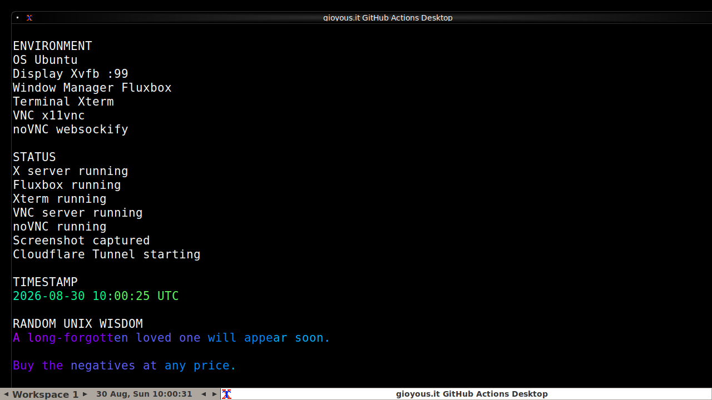

# gioyous.it 👋

> 💻 Linux enjoyer • Open-source tinkerer • Professional computer breaker

## 🐧 GitHub Actions Desktop

This profile runs a tiny graphical Linux environment in GitHub Actions:

**Xorg → Fluxbox → Xterm → lolcat**

The workflow periodically generates a fresh screenshot:

You can control It:
## Live Desktop

<VNC=https://milton-earned-vocabulary-curve.trycloudflare.com/vnc.html?autoconnect=true&resize=remote>

[See what It's doing](./STATUS.txt)

## 🛠️ Technologies

## 🐍 Contributions

<picture>
  <source media="(prefers-color-scheme: dark)" srcset="https://raw.githubusercontent.com/gioyous-it/gioyous-it/refs/heads/output/github-snake-dark.svg">
  <source media="(prefers-color-scheme: light)" srcset="https://raw.githubusercontent.com/gioyous-it/gioyous-it/refs/heads/output/github-snake.svg">
  
</picture>

---

  Built with Linux, GitHub Actions and questionable decisions.

<!--
**gioyous-it/gioyous-it** is a ✨ _special_ ✨ repository because its `README.md` (this file) appears on your GitHub profile.

Here are some ideas to get you started:

- 🔭 I’m currently working on ...
- 🌱 I’m currently learning ...
- 👯 I’m looking to collaborate on ...
- 🤔 I’m looking for help with ...
- 💬 Ask me about ...
- 📫 How to reach me: ...
- 😄 Pronouns: ...
- ⚡ Fun fact: ...
-->
